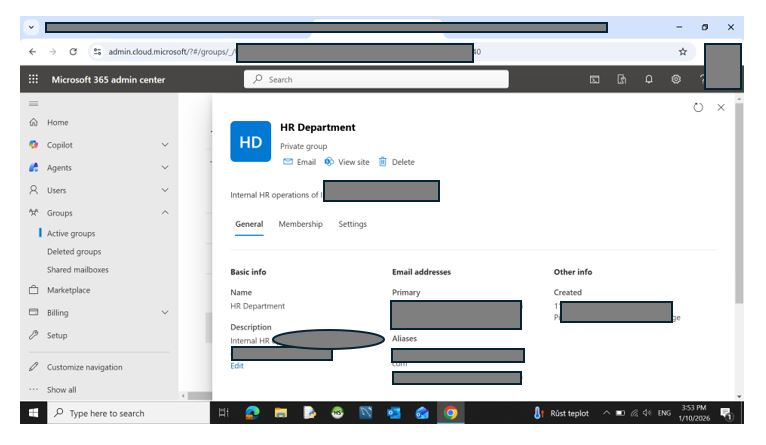
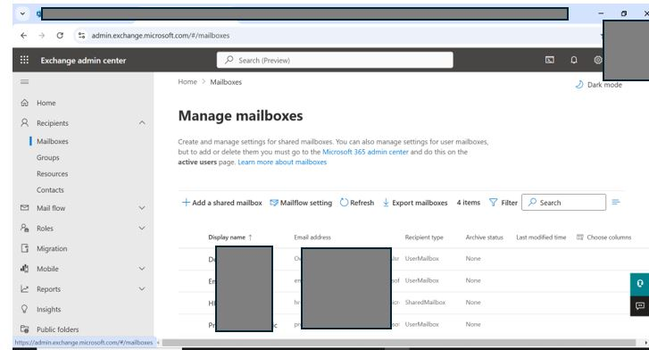

# power-platform-m365-admin-practice
This repository documents my hands-on learning and practice with Microsoft 365 administration. I use it to understand how identity, access, and basic security concepts work in real environments. The goal is not automation or advanced architecture, but learning how things actually behave in Microsoft 365 and Power Platform admin tools.
All data is anonymized.

## What I practiced
- Microsoft 365 Admin Center (users, groups, roles)
- Microsoft Entra ID (security groups, access basics)
- Exchange Admin Center (shared mailboxes, permissions)

## What I tried and tested
- Creating and configuring Microsoft 365 Groups
- Understanding group ownership vs membership
- Testing shared mailbox permissions
- Observing how changes propagate across admin centers

1. Microsoft 365 Group configuration
     

2. Microsoft Entra ID – Security Groups
     

3. Exchange Admin Center – Mailboxes
     

Configuration performed in Microsoft 365 Admin Center  
All tenant specific information and identifiers have been anonymized

### Security and privacy
All screenshots are anonymized:
- Tenant-specific URLs hidden
- Object IDs masked
- Email addresses anonymized
- No credentials or secrets exposed

### Demonstrated skills
- Identity and Access Management fundamentals
- Group-based access control
- Administrative work across M365 portals
- Security-aware documentation

### Author
Denisa Pitnerova

Junior / Associate Microsoft 365 & Power Platform Administrator  

This repository documents my hands-on learning and practice with Microsoft 365 administration. I use it to understand how identity, access, and basic security concepts work in real environments. The goal is not automation or advanced architecture, but learning how things actually behave in Microsoft 365 and Power Platform admin tools.
All data is anonymized.

## Notes for reviewers

This repository demonstrates practical administration skills rather than theoretical knowledge.  
All configurations were created manually in Microsoft 365 portals to simulate real enterprise scenarios.
